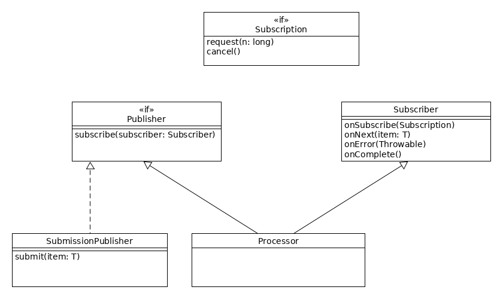

class: inverse, center, middle

# Újdonságok Java 9-től

---

## Tematika

* Nyelvi módosítások
    * Privát metódusok interfészekben
    * Try-with-resources final/effectively final változókon
    * Diamond operátor anonymous inner class esetén
* Java Module System, jlink, Multi-release JARs

---

## Tematika

* Meglévő API-k
    * Collections Framework módosítások
    * Stream API módosítások
    * IO módosítások
    * CompletableFuture API Improvements
    * Method handle
    * Multi-Resolution Image API

---

## Tematika

* További API módosítások
* Publish-Subscribe Framework - Reactive streams
* Process API, `ProcessHandle`
* JVM módosítások
* Tool frissítések
* JShell - Java REPL

---

class: inverse, center, middle

# Bevezetés

---

## Java 9

* Apróbb nyelvi kiegészítések
* Java Platform Module System (JPMS)
* API szinten továbblépés a funkcionális programozás felé
* Reactive Streams
* Process API
* JShell

https://openjdk.java.net/projects/jdk9/

---

## Több JVM egy környezetben

* `JAVA_HOME` és `PATH` környezeti változók szabályozzák
* Windowsból a `set JAVA_HOME=C:\Java\jdk-11.0.10` paranccsal állítható, és az `echo %JAVA_HOME%` paranccsal kiírható
* Linux alatt az `export JAVA=HOME=/opt/jdk-11.0.10` paranccsal állítható, és az `echo $JAVA_HOME` paranccsal kiírható
* Linux alatt: `update-alternatives`
* Továbbá: `update-java-alternatives`
* Végül: [jEnv - Manage your Java environment](https://www.jenv.be/)
* Docker
* IDE-kben függetlenül állítható (IntelliJ IDEA _File / Project Structure / Project Settings / Project / Project SDK_)

---

class: inverse, center, middle

# Java 9 nyelvi módosításai

---

## Privát metódusok interfészekben

* Statikus metódusok
* Példánymetódusok

---

## Statikus privát metódusok interfészekben

```java
public interface Printable {

    static Printable of(String csv) {
        String[] parts = csv.split(",");
        return create(parts[0], parts[1]);
    }

    static Printable of(Map<String, String> field) {
        return create(field.get("type"), field.get("title"));
    }

    private static Printable create(String type, String title) {
        // Létrehoz egy új példányt a típus alapján
    }
}
```

---

## Privát példánymetódusok interfészekben

```java
public interface Printable {

    String getTitle();

    default String getBody() {
        return "[no body]";
    }

    private String annotate(String fieldName, String content) {
        return String.format("%s: %s", fieldName, content);
    }

    default String toStringRepresentation() {
        return annotate(getTitle(), "title") +
                ", " +
                annotate(getBody(), "body");
    }
}
```

---

## try-with-resources deklarált változókon

```java
Scanner scanner = new Scanner(ReadFile.class.getResourceAsStream("employees.txt"));
try (scanner) {
    while (scanner.hasNextLine()) {
        System.out.println(scanner.nextLine());
    }
}
```

* `final` vagy _effectively final_ változókon

---

## Diamond operátor anonymous inner class esetén

```java
public interface Crate<T> {

    void put(T content);

    void empty();

}
```

```java
* Crate<String> crate = new Crate<>() {
    @Override
    public void put(String content) {
        System.out.printf("Content: %s\n", content);
    }

    @Override
    public void empty() {
        System.out.println("Empty");
    }
};
```

---

class: inverse, center, middle

# Java Platform Module System

---

class: inverse, center, middle

# Collections Framework módosítások

---

## Kollekciók létrehozása

* `Set.of`, `List.of`, `Map.of`
* Nem csak varargs, hanem sok paraméteres - gyorsabb
* Null értéket nem lehet megadni
* Unmodifiable kollekciók
      * A módosító metódusok `UnsupportedOperationException` kivételt dobnak
      * Nem feltétlenül immutable (ha az elemei módosíthatóak)

---

## Kollekciók létrehozása példák

```java
List<String> names = List.of("John Doe", "Jack Doe", "Jane Doe");
// names.set(1, "Jack Jack Doe"); // UnsupportedOperationException
// names.add("John Smith"); // UnsupportedOperationException

List<String> nicks = Arrays.asList("John", "Little John", "Johnny");
nicks.set(1, "Little Little John"); // Valid
// nicks.add("JJ"); // UnsupportedOperationException
```

---

## Set és Map

```java
Map<Long, String> employees = Map.of(1L, "John Doe", 2L, "Jack Doe", 3L, "Jane Doe");
System.out.println(employees);
```

* Minden iterálásnál más sorrendben adja vissza a `Set` és `Map` az elemeket, hogy hamarabb
   kiderüljön, ha valami a sorrendre támaszkodik
* _Entry_ alapján is létrehozható:

```java
Map<Long, String> employees = Map.ofEntries(
        Map.entry(1L, "John Doe"),
        Map.entry(2L, "Jack Doe"),
        Map.entry(3L, "Jane Doe")
    );
```

---

## IndexOutOfBoundsException konstruktor

```java
public IndexOutOfBoundsException(int index) {
        super("Index out of range: " + index);
}
```

---

## Objects metódusok

```java
public static int checkFromToIndex(int fromIndex, int toIndex, int length) {
}

public static int checkFromIndexSize(int fromIndex, int size, int length) {
}
```

---

class: inverse, center, middle

# Stream API módosítások

---

## takeWhile

```java
IntStream.range(0, 10)
    .takeWhile(i -> i < 5)
    .mapToObj(i -> i)
    .collect(Collectors.toList());
// [0, 1, 2, 3, 4]
```

---

## dropWhile

```java
IntStream.range(0, 10)
    .dropWhile(i -> i < 5)
    .mapToObj(i -> i)
    .collect(Collectors.toList());
// [5, 6, 7, 8, 9]
```

---

## ofNullable

```java
List<String> names = Stream.ofNullable(name).collect(Collectors.toList());
// name = null esetén []
```

---

## iterate

```java
Stream.iterate(0, i -> i < 10, i -> i + 1)
    .collect(Collectors.toList());
// [0, 1, 2, 3, 4, 5, 6, 7, 8, 9]
```

* Második paraméter: `Predicate<? super T> hasNext`

---

## Optional.stream()

```java
List<Optional<Integer>> numbers = List.of(
        Optional.of(0),
        Optional.of(1),
        Optional.empty(),
        Optional.of(2),
        Optional.empty()
    );

numbers.stream()
    .flatMap(Optional::stream)
    .collect(Collectors.toList());
// [0, 1, 2]
```

---

## Optional.or()

```java
String out = Optional.ofNullable(name)
    .or(() -> Optional.of("anonymous")).get();
// name = null estén "anonymous"
```

---

## Optional.ifPresentOrElse()

```java
Optional.ofNullable(name)
    .ifPresentOrElse(System.out::println, () -> System.out.println("empty"));
// name = null esetén "empty"
```

---

class: inverse, center, middle

# IO módosítások

---

## Scanner metódusok

```java
public Stream<String> tokens() {
    // ...
}

public Stream<MatchResult> findAll(Pattern pattern) {
    // ...
}

public Stream<MatchResult> findAll(String patString) {
    // ...
}

```

---

## InputStream readAllBytes

```java
public byte[] readAllBytes() throws IOException {
    // ...
}

public int readNBytes(byte[] b, int off, int len) throws IOException {
    // ...
}
```

---

## InputStream transferTo

```java
public long transferTo(OutputStream out) throws IOException {
    Objects.requireNonNull(out, "out");
    long transferred = 0;
    byte[] buffer = new byte[DEFAULT_BUFFER_SIZE];
    int read;
    while ((read = this.read(buffer, 0, DEFAULT_BUFFER_SIZE)) >= 0) {
        out.write(buffer, 0, read);
        transferred += read;
    }
    return transferred;
}
```

---

class: inverse, center, middle

# VarHandle és MethodHandle

---

## MethodHandle

* Java 7-ben jelent meg
* Alacsony szintű típusos, futtatható referencia metódusra, konstruktorra, attribútumokra, stb. (Képes paraméter és visszatérési érték transzformációra)
* Reflection egy modernebb megvalósításaként gondolhatunk rá, de nehezebb is használni
* Erre épít az _invokedynamic_, mely a dinamikus nyelvek alapja (pl. Ruby), és használatos a lambda kifejezések futtatásakor (nem készít anonimus inner classt)

---

## Példa a MethodHandle használatára

```java
Employee employee = new Employee("John Doe", 1980);

MethodType mt = MethodType.methodType(String.class); // Visszetérési típus
MethodHandles.Lookup lookup = MethodHandles.lookup();
MethodHandle mh = lookup.findVirtual(Employee.class, "getName", mt); // Osztály, metódusnév

String name = (String) mh.invoke(employee);
```

---

## Java 9 módosítások

* Ciklushoz és kivételkezeléshez hasonoló MethodHandle combinators
* Fejlettebb paraméter kezelés
* Több lookup metódus (pl. nem abstract interfész metódusokhoz)

---

## VarHandle

* Alternatívát nyújt a `java.util.concurrent.atomic` és `sun.misc.Unsafe` használatához
* Típusos referencia egy változóhoz, melyet ezen keresztül olvasni és írni is lehet
* Attribútumon segítségével atomi műveleteket lehet megvalósítani az `atomic` osztályok használata nélkül

---

## Példa a lekérdezésre és atomi módosításra

```java
VarHandle vh = MethodHandles
    .privateLookupIn(Employee.class, MethodHandles.lookup())
    .findVarHandle(Employee.class, "name", String.class);
String name = (String) vh.get(employee);
```

```java
VarHandle vh = MethodHandles
    .privateLookupIn(Employee.class, MethodHandles.lookup())
    .findVarHandle(Employee.class, "age", int.class);
int age = (int) vh.getAndAdd(employee, 1);
```

---

class: inverse, center, middle

# Egyéb API módosítások

---

## Deprecated

* Deprecated interface elemei: `forRemoval` és `since`

```java
@Deprecated(since = "1.0.0", forRemoval = true)
public int getAge() {
    return age;
}
```

---

## Deprecated API-k

```java
@Deprecated(since="9")
public Boolean(boolean value) {
    this.value = value;
}
```

```java
@Deprecated(since="9")
protected void finalize() throws Throwable { }
```

---

## Applet API

* Applet API deprecated

---
class: inverse, center, middle

# Reactive Streams

---

## Reaktív Kiáltvány 

* [The Reactive Manifesto](https://www.reactivemanifesto.org/)
  * Reszponzivitás (Responsive): az alkalmazásnak minden esetben gyors választ kell adnia
  * Ellenállóképesség (Resilient): az alkalmazásnak reszponzívaknak kell maradnia hiba esetén is
  * Elaszticitás (Elastic): reszponzivitás nagy terhelés esetén is
  * Üzenetvezéreltség (Message-driven): rendszerek elemei aszinkron, nem blokkoló módon, üzenetekkel kommunikálnak

---

## Funkcionális reaktív programozás

* Programozási paradigma, ahol a rendszer az adatelemek folyamára reagál
* Back pressure: reaktív nevezéktanban mechanizmus arra, hogy a termelő ne árassza el a fogyasztót
* Non-blocking back pressure: fogyasztó kéri a következő x elemet, amit fel tud dolgozni
* [Reactive Streams](https://www.reactive-streams.org/) kezdeményezés

---

## Reactive Streams



---

## Tipikus megvalósítás

* Publisher, ahol létrejön az adat
* Általában saját `Subscription` implementáció
* A `subscribe()` metódus hatására `Subscription` példányosítás és tárolás, `Subscriber.onSubscribe()` hívása
* A `Subscription.request()` metódus hívására `Subscriber.onNext()`, `onComplete()` vagy `onError()` hívás
* `Subscriber.onSubscribe()` hívásakor a `Subscription` eltárolása
* `Subscription.request()` hívása
* `Publisher.subscribe()` hívása egy `Subscriber`-rel
* Létező implementáció: `SubmissionPublisher`

---

## Reaktív megvalósítások <br /> Javaban

* Eclipse Vert.x
* Akka
* RxJava
* Project Reactor

---

## RxJava megvalósítás

```java
Flowable.fromIterable(employees)
                .filter(employee -> employee.getYearOfBirth() >= 2001)
                .map(Employee::getName)
                .map(String::toUpperCase)
                .subscribe(System.out::println);
```

---

## Project Reactor megvalósítás

```java
Flux.fromIterable(employees)
                .filter(employee -> employee.getYearOfBirth() >= 2001)
                .map(Employee::getName)
                .map(String::toUpperCase)
                .subscribe(System.out::println);
```

---

## Frameworkok integrálása

```java
Flux.from(Flowable.fromIterable(employees)
                .filter(employee -> employee.getYearOfBirth() >= 2001)
                .map(Employee::getName))
                .map(String::toUpperCase)
                .subscribe(System.out::println);
```

Flux `from()` metódusa:

```java
public static <T> Flux<T> from(Publisher<? extends T> source) {
    // ...
}
```

---
class: inverse, center, middle

# Process API

---

## Process API

* `ProcessHandle` interfész
    * PID
* `Info` `Optional` attribútumokkal
    * Parancs elérési útja
    * Parancssor
    * Paraméterek
    * Indítás ideje
    * CPU idő
    * Felhasználó

---

## Folyamatok lekérdezése

* Aktuális folyamat lekérdezése: `ProcessHandle.current()`
* Összes folyamat lekérdezése: `ProcessHandle.allProcesses()` streamként

---

## Információk

```java
ProcessHandle
    .allProcesses()
    .map(processHandle -> processHandle.info())
    .map(ProcessHandle.Info::toString)
    .forEach(System.out::println);
```

* `isAlive()`, `supportsNormalTermination()` metódusok
* `children()`, `descendants()` streamként, `parent()`

---

## Folyamat megszűnés

* `destroy()`, `destroyForcibly()` metódusok
* `onExit()` `CompletableFuture` visszatérési értékkel

```java
ProcessHandle.allProcesses()
                .filter(p -> filterByName(p, "notepad"))
                .forEach(p -> p.onExit().thenApply((ph) -> {
                    System.out.println("Exited");
                    latch.countDown();
                    return ph;
                }));
```

---

class: inverse, center, middle

# Мulti-Resolution Image API
---

## Мulti-Resolution Image API

```java
BufferedImage[] resolutionVariants = ....
MultiResolutionImage multiResolutionImage
  = new BaseMultiResolutionImage(resolutionVariants);
Image image = bmrImage.getResolutionVariant(16, 16);
```
---
class: inverse, center, middle

# JVM módosítások

---

## Szemétgyűjtő

* G1 az alapértelmezett szemétgyűjtő

---
class: inverse, center, middle

# Tool frissítések

---

## JavaDoc

* HTML5 támogatás
* Kereshetőség a JavaDoc-ban

---

## Egységes JVM naplózás

```shell
java -Xlog:help log.Input
java -Xlog:gc=debug:class:stdout -Xlog:class=debug:class:stdout log.Input
java -Xlog:gc=debug
java -Xlog:class+load=debug,gc=debug
java -Xlog:gc=debug:file=vm.log
```

---

## jcmd

```shell
jcmd

jcmd 7136 VM.class_hierarchy -i -s java.util.Scanner
```

---
class: inverse, center, middle

# JShell

---

## JShell

* REPL
* History, code complete, open/save

```shell
jshell

jshell> System.out.println("Hello JShell");
Hello JShell

jshell> int x = 5;
x ==> 5

jshell> int y = x + 6;
y ==> 11

jshell> /list

   1 : System.out.println("Hello JShell");
   2 : int x = 5;
   3 : int y = x + 6;

jshell> /exit
```
